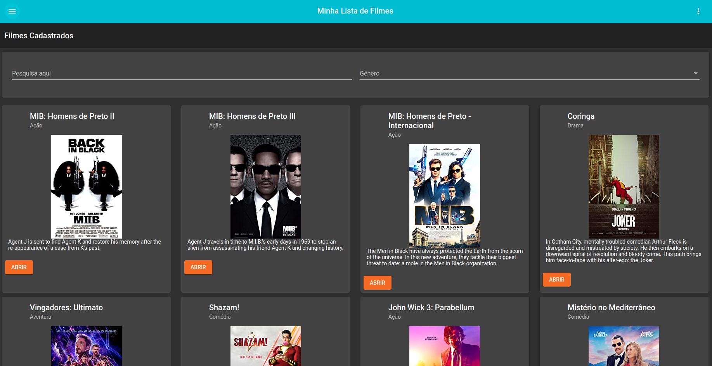
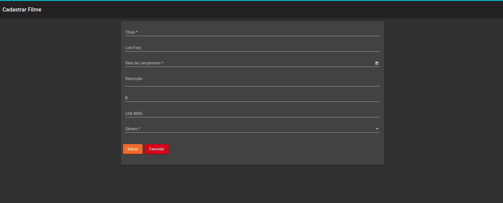
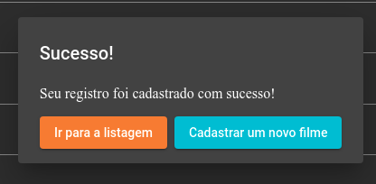
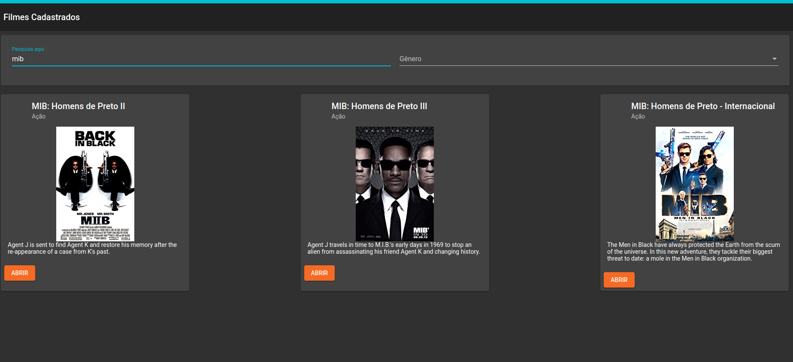
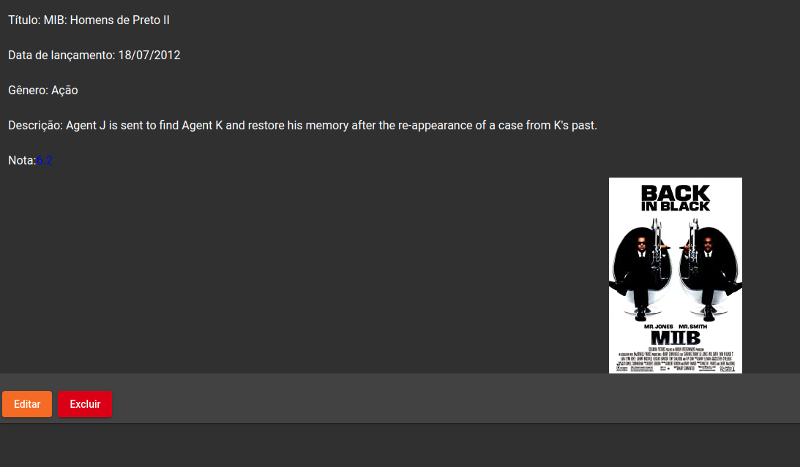

# CRUD de filmes com Angular 8 

Projeto da Digital Innovation One para a criação de um CRUD de filmes utilizando Angular 8 e json-server para simular o back-end.
## Imagens







## Instalação

Clone ou baixe o arquivo .zip do repositório

```sh
git clone https://github.com/brenovergilio/crud-filmes-angular.git
```
Navegue para a pasta do projeto e atualize as dependências com o comando npm install

```sh
cd $path/crud-filmes-angular
npm install
```

Instale o JSON-SERVER
```
npm install -g json-server
```

Inicie o JSON-SERVER local

```
json-server --watch db.json
```

Inicie o servidor local
```
ng s
```